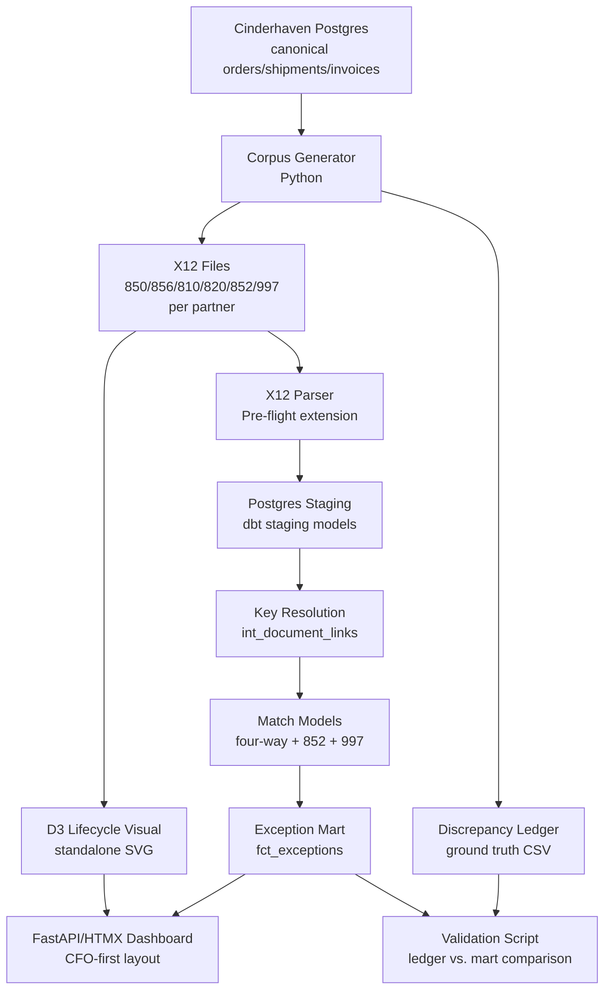

# feat: Build EDI reconciliation pipeline and exception dashboard

## Summary

Greenfield build of a complete EDI content-level reconciliation pipeline: synthetic X12 corpus generated from Cinderhaven canonical data, a Pre-flight parser extension, dbt matching models on the Cinderhaven Postgres platform using a multi-path key resolution strategy, a FastAPI/HTMX exception dashboard with CFO-first layout, a D3 PO lifecycle visual, and a failure pattern catalog. Build order is locked — corpus and discrepancy ledger first, matching key schema second, everything downstream after those two are stable.

---

## Problem Frame

EDI providers report transmission success but never reconcile document content against other document types. POs that never got ASNs, shipments with no invoice, invoices short-paid on the remittance — each mismatch is either revenue leaking or a chargeback brewing. The provider dashboard shows green checkmarks while the numbers disagree. This project builds the content-level reconciliation layer that providers don't offer, demonstrated on a synthetic Cinderhaven corpus, priced as a $18K–$30K engagement for brands with 3+ trading partners.

---

## Requirements

- R1. Generate a synthetic X12 corpus covering all six document types (850/856/810/820/852/997) for three trading partners (Walmart direct, UNFI, KeHE) with partner-specific structural quirks
- R2. Every injected discrepancy must be recorded in a traceable ledger that serves as the validation ground truth for the matching engine
- R3. Extend Pre-flight's X12 parser to handle all six document types, producing structured Python objects per document
- R4. Stage parsed documents in Postgres using dbt staging models — one model per document type
- R5. Implement multi-path key resolution: PO Number as primary anchor; ASN/BOL Number as secondary fallback; Invoice Number as tertiary fallback when neither PO nor ASN is present
- R6. Produce a four-way exception mart (850↔856↔810↔820) with classified failure types, dollar values, and dispute-window clocks
- R7. Produce an 852 sell-through reconciliation mart (shipped quantity vs. reported sell-through by partner/SKU/period)
- R8. Track 997 acknowledgments — match each ACK to its source document by ISA/GS control number; surface unacknowledged documents as a secondary exception class
- R9. Deploy a FastAPI/HTMX exception dashboard: dollar-ranked exceptions above the fold, 997 ACK status as a clearly separated secondary layer
- R10. Produce a D3 PO lifecycle SVG visual (150 → 138 → 150 → 131 canonical example) exportable as a standalone SVG at LinkedIn share dimensions
- R11. Publish a failure pattern catalog covering all seven exception types with root cause, dollar impact methodology, and fix guidance
- R12. Corpus generator, parser extension, dbt models, and dashboard are all in the repo, documented, and runnable from a single orchestration command

---

## Scope Boundaries

- No real client data upload path — the portfolio piece uses synthetic data only; real data runs as a paid engagement
- No real-time or streaming reconciliation — batch processing is the honest mid-market reality and the accurate demo posture
- No Dagster or other orchestration platform — replaced by a Makefile / Python script; orchestration complexity is not the story being told
- No 830 (planning/forecast) documents — roadmap only
- No EDI onboarding diagnostics — roadmap only
- OTIF timestamp logic is referenced but not rebuilt here — links to the OTIF Blind Spot project

### Deferred to Follow-Up Work

- 830 forecast accuracy module: separate future project once v1 ships
- Demand sensing / inventory projection: roadmap note only
- Real-data ingestion path: out of scope for portfolio; built during paid engagement

---

## Context & Research

### Relevant Code and Patterns

- Pre-flight X12 parser (edi-preflight repo) — the base parser to extend; confirmed working. Exact import path to be confirmed at implementation time.
- Cinderhaven data platform (cinderhaven-data-platform repo) — canonical source for orders, shipments, invoices; Postgres + dbt already running. Connection credentials in platform's `.env`.
- OTIF Blind Spot project — reference for ASN timing logic; do not rebuild, link to it.
- Remittance Stub Parsing project — reference for 820/stub parsing patterns; check for reusable parsing logic before writing new.

### Institutional Learnings

- No `docs/solutions/` exists in this repo yet — this project will seed it.
- Cinderhaven canonical data must be governed: new corpus seed registered in `CINDERHAVEN_CANONICAL.md`, drift-guard coverage added, injected-discrepancy ledger as validation ground truth (same pattern as trade-spend diagnostic's 59-check pattern).

### External References

- X12 transaction set specs: 850 (Purchase Order), 856 (Ship Notice/Manifest), 810 (Invoice), 820 (Payment Order/Remittance Advice), 852 (Product Activity Data), 997 (Functional Acknowledgment)
- UNFI EDI trading partner guide for promo coding qualifiers in 850 (SLN segment usage)
- KeHE EDI requirements for 810 invoice (specific REF qualifier expectations)

---

## Key Technical Decisions

- **Multi-path key resolution over unified-only anchor**: In real EDI traffic, 820s often arrive without PO references (especially from distributors). The matching engine uses a resolution hierarchy — PO Number primary, ASN/BOL secondary, Invoice Number tertiary — rather than failing when the PO is absent. This reflects real engagement conditions and is more defensible to technical evaluators.
- **Discrepancy ledger as first-class artifact**: The ledger is not a test fixture — it is a deliverable that demonstrates how the matching engine would be validated in a real engagement. It records exactly what was injected, allowing the engine to be scored: found / missed / false-positive. This is the equivalent of the trade-spend diagnostic's 59-check pattern.
- **dbt for matching models**: The match logic lives in SQL + dbt models, not in Python. This is a deliberate portfolio signal — it shows platform-integrated data engineering, not just scripting. The Python layer handles parsing and loading only.
- **CFO-first dashboard layout**: Dollar-impact exceptions render above the fold. 997 ACK status is a secondary section with its own visual treatment, clearly labeled "For EDI/Ops Teams." This ordering is non-negotiable — the portfolio piece is positioned at CFO/controller audiences.
- **Corpus generated from Cinderhaven canonical**: The synthetic documents must tie to canonical revenue and chargeback figures so the dollar values are internally consistent with the platform. Fully random synthetic data would not serve the Cinderhaven platform story. New seed registered in `CINDERHAVEN_CANONICAL.md`.
- **D3 lifecycle visual as standalone SVG + dashboard embed**: The visual is authored as a self-contained SVG file that works both embedded in the dashboard and exported for LinkedIn. LinkedIn dimensions: 1200×628px. The visual is the primary distribution mechanism and must not depend on the dashboard being live to share.
- **No Dagster**: The pipeline is linear (generate → parse → stage → match → serve). A Makefile with ordered targets is sufficient and more transparent for a portfolio reviewer to understand.
- **UoM conversion as dbt seed**: Unit-of-measure conversion factors (eaches/cases/inner packs per partner per SKU) are stored as a dbt seed CSV, not hardcoded in Python or SQL. This makes them auditable, version-controlled, and easily extended.

---

## Open Questions

### Resolved During Planning

- Anchor vs. bilateral schema: hybrid multi-path resolution (see Key Technical Decisions)
- 997 placement in dashboard: secondary layer, labeled "For EDI/Ops Teams"
- Dagster: dropped; replaced by Makefile
- Database: Postgres on Cinderhaven platform (not DuckDB)
- Corpus data source: generated from Cinderhaven canonical, not independently synthetic
- Stack: Python + Postgres + dbt + FastAPI + HTMX + D3

### Deferred to Implementation

- Exact Pre-flight parser import path and interface — confirm at build time by reading edi-preflight source
- UNFI promo coding qualifier codes — verify against UNFI EDI spec at corpus generation time
- KeHE 810 REF qualifier requirements — verify against KeHE spec at corpus generation time
- Exact Cinderhaven schema for orders/shipments/invoices — read from platform at implementation time
- Tolerance thresholds (quantity: ±1 case? dollar: ±$5?) — confirm with domain expert during corpus review

---

## Output Structure

    edi-reconciliation-tool/
    ├── corpus/
    │   ├── generator/
    │   │   ├── base.py          # reads Cinderhaven canonical
    │   │   ├── partners/
    │   │   │   ├── walmart.py
    │   │   │   ├── unfi.py
    │   │   │   └── kehe.py
    │   │   ├── injector.py      # discrepancy injection
    │   │   └── ledger.py        # discrepancy ledger writer
    │   └── output/              # generated X12 files (gitignored)
    ├── parser/
    │   ├── x12_parser.py        # Pre-flight extension
    │   └── models.py            # Python dataclasses per doc type
    ├── transforms/
    │   ├── dbt_project.yml
    │   ├── models/
    │   │   ├── staging/
    │   │   │   ├── stg_850_pos.sql
    │   │   │   ├── stg_856_asns.sql
    │   │   │   ├── stg_810_invoices.sql
    │   │   │   ├── stg_820_remittances.sql
    │   │   │   ├── stg_852_activity.sql
    │   │   │   └── stg_997_acks.sql
    │   │   └── marts/
    │   │       ├── int_document_links.sql   # key resolution
    │   │       ├── int_four_way_match.sql
    │   │       ├── int_852_match.sql
    │   │       ├── int_997_match.sql
    │   │       └── fct_exceptions.sql       # final exception mart
    │   └── seeds/
    │       └── uom_conversions.csv
    ├── dashboard/
    │   ├── app.py               # FastAPI
    │   ├── routes/
    │   ├── templates/
    │   └── static/
    │       └── js/lifecycle.js  # D3 visual
    ├── visuals/
    │   └── po_lifecycle.svg     # standalone export
    ├── catalog/
    │   └── failure_patterns.md
    ├── tests/
    │   ├── test_generator.py
    │   ├── test_parser.py
    │   └── test_matching.py
    ├── Makefile
    └── fly.toml

---

## High-Level Technical Design

> *This illustrates the intended approach and is directional guidance for review, not implementation specification. The implementing agent should treat it as context, not code to reproduce.*



**Key resolution hierarchy** (applied in `int_document_links`):

```
For each 856/810/820/997, resolve to its source PO:
  1. If document carries PO Number reference → use it (primary anchor)
  2. Else if document carries ASN/BOL Number → join to 856 → resolve PO (secondary)
  3. Else if document carries Invoice Number → join to 810 → resolve PO (tertiary)
  4. Else → orphan record, surfaces as a 997/820 exception
```

**Exception classification** (in `fct_exceptions`):

| Class | Source | Dollar value |
|---|---|---|
| shipped-not-invoiced | 856 quantity > 810 quantity | unmatched qty × 850 unit price |
| short-pay | 810 amount > 820 amount | 810 amount − 820 amount |
| ordered-not-ASN'd | 850 with no 856 | unmatched qty × 850 unit price |
| UoM mismatch | 856/810 UoM ≠ 850 UoM after conversion | delta × unit price |
| mapping drift | retailer item # → no internal SKU | quantity × last-known price |
| 852 discrepancy | sell-through ≠ shipped quantity | delta × wholesale price |
| 997 missing ACK | document with no 997 response within window | N/A (ops exposure) |

---

## Implementation Units

### U1. Discrepancy ledger schema and corpus generator scaffold

**Goal:** Define the discrepancy ledger format and build the corpus generator's skeleton, including the Cinderhaven canonical data reader.

**Requirements:** R1, R2, R12

**Dependencies:** None — this is the critical-path starting point.

**Files:**
- Create: `corpus/generator/base.py`
- Create: `corpus/generator/ledger.py`
- Create: `corpus/generator/__init__.py`
- Create: `tests/test_generator.py`

**Approach:**
- Ledger schema: one row per injected discrepancy with fields for partner, document type, document reference (ISA control number), field path, expected value, actual value, discrepancy class (one of the 7 types), and computed dollar impact
- `base.py` connects to the Cinderhaven Postgres instance (reads from environment variables), queries canonical orders/shipments/invoices, and yields normalized records that partner-specific generators consume
- Ledger is written as CSV (human-readable, domain expert can open in Excel for review) and as Parquet (efficient for the validation script)
- Generator scaffold includes a `generate(partner, seed)` interface that partner modules implement

**Patterns to follow:**
- Cinderhaven canonical data connection pattern from cinderhaven-data-platform repo
- `CINDERHAVEN_CANONICAL.md` registration pattern (new seed entry for this corpus)

**Test scenarios:**
- Happy path: `base.py` connects to Cinderhaven Postgres and returns at least one canonical order record without error
- Happy path: ledger writer produces a valid CSV with all required columns for a single injected discrepancy
- Edge case: Cinderhaven canonical has zero shipments for a period → generator raises a descriptive error, not a silent empty corpus
- Edge case: ledger records a split-shipment discrepancy (one 850 line → two 856 items) with correct per-item dollar values

**Verification:**
- `python -m corpus.generator.base` connects to Cinderhaven and prints canonical record count
- Ledger CSV schema matches the defined format; all required columns present

---

### U2. Synthetic X12 corpus generation

**Goal:** Generate complete, realistic X12 corpora for all three trading partners with partner-specific quirks and controlled discrepancy injection.

**Requirements:** R1, R2

**Dependencies:** U1

**Files:**
- Create: `corpus/generator/partners/walmart.py`
- Create: `corpus/generator/partners/unfi.py`
- Create: `corpus/generator/partners/kehe.py`
- Create: `corpus/generator/injector.py`
- Create: `corpus/output/` (gitignored directory)
- Modify: `tests/test_generator.py`

**Approach:**
- Each partner module generates all six document types using the X12 segment structure: ISA/GS envelope, document-specific segments, IEA/GE trailer
- Partner quirks to implement:
  - Walmart: direct-to-retailer PO flow; 997 ACKs within 24 hours; standard segment structure
  - UNFI: distributor channel; 850 SLN segment for promo allowance coding; 852 sell-through reports weekly; PO reference sometimes absent on 820
  - KeHE: distributor channel; 810 requires specific REF qualifier for distributor invoice number; 856 uses multiple HL loops for multi-stop shipments
- `injector.py` applies the seven discrepancy types to a generated corpus according to a configurable injection rate; records every injection to the ledger
- UoM mix: Walmart orders in cases, invoices in eaches (triggers UoM mismatch class); UNFI/KeHE use cases throughout
- Partial shipment scenario: one 850 across two 856s for at least one Walmart PO
- Credit/rebill scenario: 810 credit + 810 rebill for at least one UNFI invoice

**Patterns to follow:**
- ISA/GS envelope structure from Pre-flight corpus (if accessible) or X12 spec
- UNFI EDI trading partner spec for SLN promo qualifiers

**Test scenarios:**
- Happy path: generated 850 for each partner has valid ISA envelope, correct BEG segment (PO number, date, type code), and at least one PO1 line
- Happy path: UNFI 850 includes SLN segment with promo allowance coding
- Happy path: KeHE 810 carries expected REF qualifier for distributor invoice number
- Happy path: injector applies `shipped-not-invoiced` discrepancy — 856 has higher quantity than corresponding 810; ledger records delta and dollar value
- Happy path: partial shipment — one 850 generates two 856s; quantities on both 856s sum to 850 quantity minus injected shortage
- Edge case: credit/rebill chain — 810 credit has negative dollar amount; net of credit + rebill equals expected payment amount
- Edge case: UNFI 820 with no PO reference — document is generated without PRF segment; key resolution fallback will be needed at match time
- Integration: domain expert review — ledger CSV is readable in Excel and every injected discrepancy is traceable to a specific document reference

**Verification:**
- `make corpus` generates files for all three partners with no errors
- Ledger CSV row count equals the configured injection count
- Generated X12 files pass a basic structural validation (ISA/IEA balance, GS/GE balance)

---

### U3. Pre-flight parser extension

**Goal:** Extend Pre-flight's X12 parser to handle all six document types, producing structured Python dataclasses per document.

**Requirements:** R3, R12

**Dependencies:** U2 (corpus must exist to test parsing against)

**Files:**
- Create: `parser/x12_parser.py`
- Create: `parser/models.py`
- Create: `parser/__init__.py`
- Create: `tests/test_parser.py`

**Approach:**
- Read Pre-flight's parser interface before writing anything — extend it, do not replace it
- `models.py` defines Python dataclasses for each document type: PurchaseOrder (850), ShipNotice (856), Invoice (810), Remittance (820), ProductActivity (852), FuncAck (997)
- Each dataclass captures the fields needed for matching: key references (PO number, ASN number, invoice number, ISA control number), line items with quantities/UoM/prices, partner ID, document date
- Parser routes by transaction set ID (850, 856, 810, 820, 852, 997) from the ST segment
- Error handling: malformed segments raise a structured `X12ParseError` with segment index and context — not a bare Python exception

**Execution note:** Read Pre-flight's existing parser source before writing `x12_parser.py` — extend the existing parsing interface rather than introducing a parallel one.

**Patterns to follow:**
- Pre-flight X12 parser (edi-preflight repo) — confirm the import interface before writing

**Test scenarios:**
- Happy path: parse a minimal valid 850 with two PO1 lines → PurchaseOrder dataclass with correct po_number, two line items with quantity and unit_price
- Happy path: parse 856 with two HL loops (multi-stop shipment) → ShipNotice with two shipment items
- Happy path: parse 820 with three RMR segments (three invoices in one remittance) → Remittance with three payment line items
- Happy path: parse 997 → FuncAck with acknowledged ISA control number and acceptance code
- Edge case: parse UNFI 850 with SLN promo segment → SLN data captured in PurchaseOrder without breaking the PO1 line parsing
- Edge case: parse 810 credit (negative BIG amount) → Invoice dataclass with negative total; credit flag set
- Error path: missing IEA trailer → `X12ParseError` raised with segment index pointing to last valid segment
- Integration: run parser over the full generated corpus (U2) → zero parse errors; document counts match expected totals per partner

**Verification:**
- `pytest tests/test_parser.py` passes for all document types
- Parsing the complete U2 corpus produces expected document counts with no errors

---

### U4. Document staging tables and dbt staging models

**Goal:** Define Postgres staging schema and write dbt staging models that load parsed documents into queryable tables.

**Requirements:** R4, R12

**Dependencies:** U3 (parser defines the field structure that staging models consume)

**Files:**
- Create: `transforms/dbt_project.yml`
- Create: `transforms/profiles.yml`
- Create: `transforms/models/staging/stg_850_pos.sql`
- Create: `transforms/models/staging/stg_856_asns.sql`
- Create: `transforms/models/staging/stg_810_invoices.sql`
- Create: `transforms/models/staging/stg_820_remittances.sql`
- Create: `transforms/models/staging/stg_852_activity.sql`
- Create: `transforms/models/staging/stg_997_acks.sql`
- Create: `transforms/seeds/uom_conversions.csv`

**Approach:**
- A Python loader script (`corpus/loader.py`) reads parsed document objects from U3 and writes raw records to Postgres source tables; dbt staging models clean and type-cast from there
- Each staging model selects the fields needed for matching: document key references, partner_id, line items (expanded to one row per line), quantities, UoM codes, prices, document date
- Line items are expanded at the staging layer — one row per line, not one row per document; this is the grain the match models operate on
- `uom_conversions.csv` seed: columns are `partner_id`, `from_uom`, `to_uom`, `conversion_factor`; populated with known Walmart/UNFI/KeHE conversions (cases↔eaches, cases↔inner packs)
- Staging models include a `loaded_at` timestamp for pipeline auditing

**Patterns to follow:**
- Cinderhaven platform dbt conventions (profile name, target schema, materialization defaults)
- Confirm schema naming convention from cinderhaven-data-platform before writing `profiles.yml`

**Test scenarios:**
- Happy path: `dbt run --select staging` succeeds on the full corpus; each staging table has correct row count (one row per line item)
- Happy path: `dbt seed` loads `uom_conversions.csv` without errors
- Edge case: 820 with three RMR segments → three rows in `stg_820_remittances`, not one
- Edge case: 810 credit document → `stg_810_invoices` row has negative `invoice_amount` and `is_credit = true`
- Edge case: duplicate ISA control number from the same partner → staging model deduplicates on `(partner_id, isa_control_number, line_number)`
- Verification: staging row counts per document type match corpus generator's output counts

**Verification:**
- `dbt run --select staging` and `dbt seed` complete with no errors
- `dbt test` passes all staging model schema tests (not-null, unique keys)
- Row counts in staging tables match counts from the corpus generator ledger

---

### U5. Matching key resolution and exception mart

**Goal:** Build the core matching engine — multi-path key resolution, four-way match, 852 sell-through match, 997 ACK match, and the final exception mart with dollar values and dispute-window clocks.

**Requirements:** R5, R6, R7, R8, R12

**Dependencies:** U4 (staging models must be stable)

**Files:**
- Create: `transforms/models/marts/int_document_links.sql`
- Create: `transforms/models/marts/int_four_way_match.sql`
- Create: `transforms/models/marts/int_852_match.sql`
- Create: `transforms/models/marts/int_997_match.sql`
- Create: `transforms/models/marts/fct_exceptions.sql`
- Create: `tests/test_matching.py`

**Approach:**
- `int_document_links.sql`: resolves every document to its canonical PO anchor using the three-tier hierarchy. For each 856/810/820/997, joins on: (1) PO Number reference if present; (2) ASN/BOL Number → 856 → PO if PO absent; (3) Invoice Number → 810 → PO if neither PO nor ASN present. Outputs a link table with `(po_number, partner_id, document_type, document_reference, resolution_path)`.
- `int_four_way_match.sql`: joins 850 lines → 856 items → 810 lines → 820 payments through the link table. UoM conversion applied using the `uom_conversions` seed before quantity comparison. Tolerance rules applied: quantity tolerance configurable via dbt variable (default ±1 case); dollar tolerance configurable (default ±$5). Outputs one row per PO line with matched quantities/amounts at each stage and a `match_status` flag.
- `int_852_match.sql`: joins 852 sell-through records to 856 shipments by partner/SKU/period. Computes delta (shipped − reported sell-through).
- `int_997_match.sql`: joins 997 ACK records to source documents by ISA/GS control number. Flags documents with no ACK received within 48-hour window.
- `fct_exceptions.sql`: unions all exception types from the three match models. Computes `dollar_impact` per exception class (see classification table in High-Level Technical Design). Adds `dispute_window_days` (30 days for short-pay from 820 date; 60 days for chargebacks from transaction date) and `dispute_window_expires_at`. Includes `resolution_path` from the link table so exceptions show how they were matched.

**Patterns to follow:**
- Cinderhaven platform dbt materialization conventions
- Tolerance rules as dbt variables (not hardcoded in SQL) — makes them configurable per engagement

**Test scenarios:**
- Happy path (PO-anchored): 850 line with a matching 856 item, 810 line, and 820 payment — all quantities match within tolerance → no exception generated
- Happy path (exception): 850 line with matching 856 but 810 quantity is lower → `shipped-not-invoiced` exception with correct dollar value (delta × unit price from 850)
- Happy path (short-pay): 810 amount $500, 820 payment $450 → `short-pay` exception, dollar_impact = $50, dispute_window_expires_at = 820 date + 30 days
- Happy path (ordered-not-ASN'd): 850 line with no 856 match → `ordered-not-ASN'd` exception with dollar value = unmatched quantity × 850 unit price
- Edge case (UoM mismatch): 850 in cases (12 eaches/case), 856 in eaches → after UoM conversion, quantities match → no exception. If post-conversion quantities diverge → UoM mismatch exception.
- Edge case (partial shipment): one 850 line, two 856 items — quantities sum to 850 quantity → no exception. If sum is short → shortage exception with combined dollar impact.
- Edge case (ASN fallback): UNFI 820 has no PO reference → resolved via invoice number → exception correctly attributed to the originating PO
- Edge case (credit/rebill): 810 credit + 810 rebill — net dollar matches 820 payment → no exception. If net diverges → short-pay exception on net delta.
- Edge case (852 discrepancy): shipped 100 cases to UNFI, 852 reports 85 cases sold through → delta of 15 cases flagged with dollar impact at wholesale price
- Edge case (997 missing): document sent to KeHE with no 997 received within 48 hours → missing-ACK exception with no dollar value
- Validation: all discrepancies in the U1/U2 ledger appear as exceptions in `fct_exceptions` (zero misses)
- Validation: documents where the ledger records no injected discrepancy do not appear in `fct_exceptions` (zero false positives)

**Verification:**
- `dbt run --select marts` completes with no errors
- `dbt test` passes all mart model tests
- Validation script comparing `fct_exceptions` to the discrepancy ledger shows 100% recall and 0 false positives on the synthetic corpus
- `pytest tests/test_matching.py` passes (integration tests hitting the Postgres instance with test fixtures)

---

### U6. FastAPI/HTMX exception dashboard

**Goal:** Deploy a FastAPI/HTMX web app that presents the exception mart with CFO-first layout and 997 ACK status as a clearly separated secondary layer.

**Requirements:** R9, R12

**Dependencies:** U5 (exception mart must be populated)

**Files:**
- Create: `dashboard/app.py`
- Create: `dashboard/routes/exceptions.py`
- Create: `dashboard/routes/lifecycle.py`
- Create: `dashboard/templates/base.html`
- Create: `dashboard/templates/dashboard.html`
- Create: `dashboard/templates/lifecycle.html`
- Create: `dashboard/static/css/lailara.css`

**Approach:**
- Dashboard layout (above the fold): dollar-ranked exception summary cards by failure class (total dollar exposure, count, dispute clock status). Below the summary: filterable exception list by partner, failure class, and date range.
- 997 section: separate card/section below the main exception list, labeled "EDI/Ops: Transmission Status." Shows unacknowledged documents with partner, document type, sent date, and hours since send.
- HTMX: filter controls update the exception list via server-side query, no full-page reload. Partner filter, failure class filter, date range filter.
- Dispute window urgency: exceptions where `dispute_window_expires_at` is within 7 days render with a visual warning (Singapore orange per Lailara design system).
- Color system: Lailara design system (Tokyo red for failed/short-pay, HK teal for matched, Singapore orange for warning/expiring). All colors from `LAILARA_DESIGN_SYSTEM.md`.
- Read `LAILARA_DESIGN_SYSTEM.md` before writing any CSS or color values.
- Route `/lifecycle` renders the D3 visual page (hooks into U7).

**Patterns to follow:**
- Pre-flight FastAPI/HTMX structure (confirm before writing `app.py`)
- Lailara design system: `C:\Users\mssha\projects\published\lailara-design-system\LAILARA_DESIGN_SYSTEM.md`

**Test scenarios:**
- Happy path: `GET /` returns 200 with exception summary cards visible
- Happy path: dollar-ranked list shows highest-dollar exception first
- Happy path: 997 section is present and visually distinct from the main exception list
- Happy path: HTMX partner filter sends `GET /?partner=UNFI` and returns updated exception list without full page reload
- Edge case: empty exception mart (zero exceptions) → dashboard shows "No exceptions found" state with a note on what this means
- Edge case: all exceptions in one class → other class cards show zero with correct empty state
- Edge case: dispute window expires today → exception row renders with orange urgency indicator

**Verification:**
- `uvicorn dashboard.app:app` starts without errors
- Dashboard loads at `localhost:8000` with exception data from the populated mart
- 997 section is visually below and clearly separated from the main exception list
- Lailara color tokens are used throughout — no raw hex values in CSS

---

### U7. D3 PO lifecycle visual

**Goal:** Build the PO lifecycle SVG visual (ordered → shipped → invoiced → paid) as a standalone SVG and embed it in the dashboard.

**Requirements:** R10, R12

**Files:**
- Create: `dashboard/static/js/lifecycle.js`
- Create: `visuals/po_lifecycle.svg`

**Approach:**
- The canonical example: 150 ordered → 138 shipped → 150 invoiced → 131 paid. Four labeled boxes connected by arrows, with discrepancy callouts at each transition.
- Callout annotations: "−12 cases not shipped (OTIF exposure)", "+12 cases invoiced not in ASN (unbilled risk)", "−19 cases short-paid ($X dispute exposure)".
- SVG at 1200×628px for LinkedIn share dimensions. Background: Lailara canvas (`#f5f3ee`). Typography: Playfair Display for numbers, Source Sans 3 for labels.
- Standalone `po_lifecycle.svg` is a static file committed to the repo — generated once and versioned.
- `lifecycle.js` in the dashboard renders a live version from the actual exception mart data (so the dashboard shows real numbers from the corpus, not hardcoded values).
- Read `LAILARA_DESIGN_SYSTEM.md` before setting any color, font, or spacing values.

**Patterns to follow:**
- Lailara design system for all visual tokens
- Economist chart rules: no gradients, no decorative elements, every number labeled

**Test scenarios:**
- Happy path: `po_lifecycle.svg` opens in a browser at 1200×628, all four boxes and arrows render correctly
- Happy path: dashboard `/lifecycle` route returns 200 with the live D3 visual
- Happy path: live D3 visual shows actual corpus numbers, not hardcoded values
- Edge case: corpus has zero discrepancies → all four lifecycle values are equal; no callout annotations render
- Edge case: corpus numbers exceed 4 digits → labels truncate or wrap without overlapping the box outlines

**Verification:**
- `po_lifecycle.svg` opens cleanly in Chrome and Firefox
- SVG can be saved directly from the browser and shared without losing fonts or colors (fonts self-hosted or embedded in SVG)
- Dashboard lifecycle page matches the standalone SVG in layout and color

---

### U8. Failure pattern catalog

**Goal:** Publish a static page documenting all seven exception types with root cause, dollar impact methodology, and fix guidance.

**Requirements:** R11, R12

**Dependencies:** U5, U6 (catalog references real examples from the exception mart)

**Files:**
- Create: `catalog/failure_patterns.md`
- Create: `dashboard/templates/catalog.html`
- Create: `dashboard/routes/catalog.py`

**Approach:**
- One section per failure class: shipped-not-invoiced, short-pay, ordered-not-ASN'd, UoM mismatch, mapping drift, 852 sell-through discrepancy, 997 missing ACK
- Each section: what it is (one sentence), why it happens (root cause), how the matching engine detects it (key reference chain used), how dollar impact is computed (formula in plain English), the fix (what ops needs to do), and a real example from the synthetic corpus (document references from the generated corpus)
- Catalog is a static page served from FastAPI (not a live query) — content is in `failure_patterns.md`, rendered at deploy time
- Target reader is an EDI coordinator or controller — no jargon left unexplained

**Test scenarios:**
- Happy path: `/catalog` route returns 200 with all seven failure patterns present
- Happy path: each pattern section includes the root cause, detection logic, dollar formula, and fix
- Edge case: 997 missing ACK section correctly notes "dollar impact: N/A — operational exposure, not revenue"

**Verification:**
- All seven failure classes documented with no blank sections
- A non-EDI reader (tested informally) can explain back what "UoM mismatch" means after reading the catalog entry

---

### U9. Deployment and orchestration

**Goal:** Wire the full pipeline into a single `make` command and deploy the dashboard to Fly.io.

**Requirements:** R12

**Dependencies:** U1–U8 (all units complete)

**Files:**
- Create: `Makefile`
- Create: `fly.toml`
- Create: `requirements.txt`
- Create: `.env.example`
- Modify: `.gitignore` (add `corpus/output/`, `.env`)

**Approach:**
- `Makefile` targets in order: `corpus` (runs generator), `parse` (runs parser + loader), `transform` (runs dbt seed + dbt run), `validate` (runs ledger vs. mart comparison), `serve` (starts FastAPI), `all` (runs corpus → parse → transform → validate → serve)
- `fly.toml` targets a Fly.io app; FastAPI app served via gunicorn. Database connection via Fly.io secrets (not env file).
- `.env.example` lists all required variables: `CINDERHAVEN_DB_URL`, `EDI_CORPUS_SEED`, `TOLERANCE_QTY_CASES`, `TOLERANCE_DOLLAR`.
- `requirements.txt` pins all dependencies with exact versions.
- Decide subdomain before deployment: either `reconcile.lailarallc.com` (new) or `edi.lailarallc.com/reconcile` (fold under Pre-flight). Record in `DECISIONS.md` once decided.

**Test scenarios:**
- Happy path: `make all` on a clean environment completes without errors; dashboard accessible at `localhost:8000`
- Happy path: `fly deploy` succeeds from a clean `fly.toml`; app accessible at the configured subdomain
- Error path: missing `CINDERHAVEN_DB_URL` → `make corpus` fails with a descriptive error message naming the missing variable, not a Python traceback
- Edge case: `make corpus` run twice → second run overwrites output cleanly without duplicate staging records

**Verification:**
- `make all` completes end-to-end from a fresh clone with only `.env` configured
- Dashboard is live at the Fly.io subdomain
- `DECISIONS.md` updated with subdomain choice

---

## System-Wide Impact

- **Cinderhaven platform dependency**: this project reads from the Cinderhaven Postgres instance. Any schema changes to the canonical orders/shipments/invoices tables in the platform could break the corpus generator. The `CINDERHAVEN_CANONICAL.md` registration is the governance mechanism.
- **Pre-flight parser dependency**: this project extends Pre-flight's parser. If Pre-flight's interface changes, `parser/x12_parser.py` needs updating. No circular dependency — this project only reads from Pre-flight, never writes back.
- **New Cinderhaven seed**: the synthetic corpus introduces a new seed in `CINDERHAVEN_CANONICAL.md`. Drift-guard coverage must be added alongside registration so future canonical changes are caught before they silently invalidate the corpus.
- **Unchanged invariants**: Pre-flight's existing validation logic (is this document structurally valid?) is not modified by this project. The extension adds new document type parsers; it does not change existing parser behavior.
- **Error propagation**: corpus generation failures should be loud and fail-fast — a silent partial corpus produces wrong match results. `make corpus` should exit non-zero on any document generation error.

---

## Risks & Dependencies

| Risk | Likelihood | Impact | Mitigation |
|------|-----------|--------|------------|
| Pre-flight parser interface has changed since it was "confirmed working" | Low | High | Read Pre-flight source before writing U3; adapt to actual interface, not assumed one |
| UNFI/KeHE partner quirks are wrong — promo qualifiers or REF codes don't match real specs | Medium | Medium | Domain expert review of corpus in U2 is the control; deferred tolerance thresholds confirmed at that time |
| Cinderhaven canonical schema doesn't match what the corpus generator expects | Low | High | Read platform schema before writing `base.py`; don't assume column names from memory |
| Matching key fallback (ASN/Invoice path) produces false positives on the synthetic corpus | Medium | Medium | Discrepancy ledger validation script (U5) is the detection mechanism; if false positives appear, tighten the fallback join conditions |
| D3 visual fonts don't embed cleanly in LinkedIn SVG share | Low | Medium | Test SVG share early in U7; embed fonts directly in SVG if web fonts don't survive the share path |
| Subdomain DNS configuration delays deployment | Low | Low | Decide subdomain before U9; configure DNS in advance |

---

## Alternative Approaches Considered

- **Dagster for orchestration**: Rejected. Dagster is a full platform (daemon, scheduler, UI) that adds setup complexity without adding value to the portfolio story. The matching engine is what's being demonstrated, not the scheduler. A Makefile is more transparent for a technical reviewer.
- **DuckDB instead of Postgres**: Considered when Cinderhaven platform availability was uncertain. Rejected once confirmed that the platform is running and is the SSOT for 20 projects. Using Postgres keeps the matching models platform-integrated, which is part of the story.
- **Bilateral match tables (850↔856, 856↔810 separately)**: Considered. Rejected in favor of the multi-path key resolution approach (`int_document_links`) because real EDI traffic doesn't always have a PO reference on the 820 or 810. The link table approach mirrors what a real engagement would need and is more defensible.
- **Independent synthetic data (not from Cinderhaven canonical)**: Considered for simplicity. Rejected because the portfolio story requires dollar values that tie to canonical Cinderhaven revenue figures. Independent random data would not serve the platform coherence story.

---

## Phased Delivery

### Phase 1 — Foundation (U1 → U2 → U3 → U4)
Corpus generation, parsing, and staging. At the end of Phase 1, the Postgres staging tables are populated with realistic synthetic X12 data and the discrepancy ledger is written. Nothing is visible to an end user yet, but the data is trustworthy and testable.

*Gate: domain expert reviews corpus and ledger before Phase 2 begins. Tolerance thresholds confirmed.*

### Phase 2 — Matching engine (U5)
The core matching models, exception mart, and validation script. At the end of Phase 2, the exception mart is populated and the validation script confirms the matching engine finds all injected discrepancies with zero false positives.

*Gate: validation script passes (100% recall, 0 false positives) before Phase 3 begins.*

### Phase 3 — Portfolio surface (U6 → U7 → U8 → U9)
Dashboard, D3 visual, failure pattern catalog, deployment. At the end of Phase 3, all five deliverables are live and the project is shippable.

---

## Sources & References

- **Origin document:** [brief_edi_reconciliation_v2.md](brief_edi_reconciliation_v2.md)
- **Lailara Design System:** `C:\Users\mssha\projects\published\lailara-design-system\LAILARA_DESIGN_SYSTEM.md` (read before writing any CSS)
- **Pre-flight parser:** edi-preflight repo (confirm import interface before U3)
- **Cinderhaven platform:** cinderhaven-data-platform repo (confirm schema before U1)
- **CINDERHAVEN_CANONICAL.md:** register new corpus seed before generating corpus
- **OTIF Blind Spot project:** reference for ASN timing logic (do not rebuild)
- **Remittance Stub Parsing project:** reference for 820 parsing patterns (check before writing U3 820 parser)
